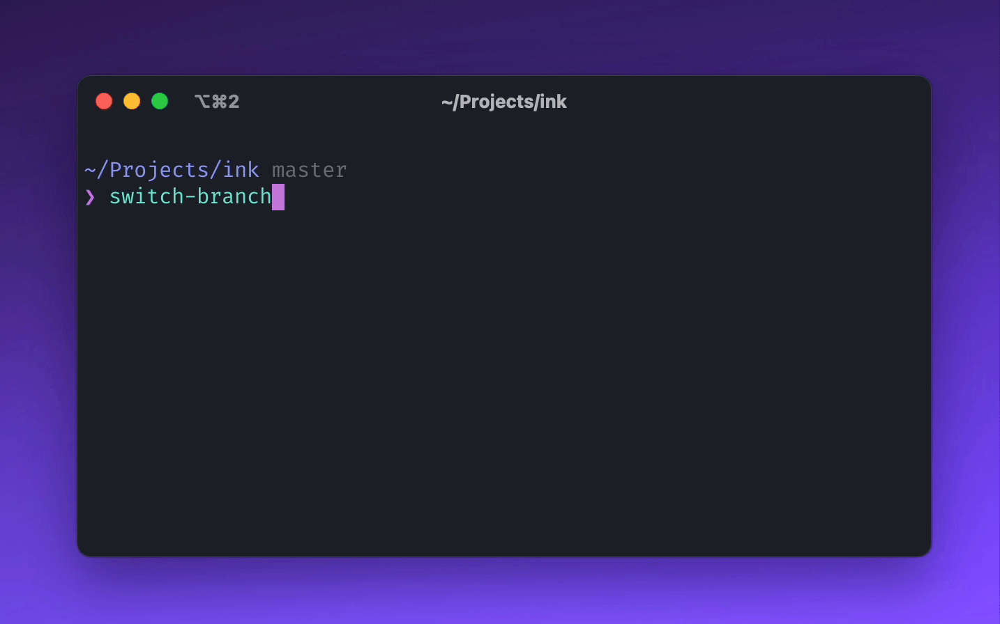

# switch-branch-cli [](https://github.com/vadimdemedes/switch-branch-cli/actions)

> Switch Git branches by their pull request title



## Install

```console
npm install --global switch-branch-cli
```

## Usage

```
$ switch-branch --help

  Switch Git branches by their pull request title

  Usage
    $ switch-branch

```

## FAQ

### Why does it ask for my GitHub personal access token?

This CLI needs it to fetch your pull requests for the current Git repository. Your personal access token is stored locally and you will be asked for it only once (unless you revoke it or token expires).
